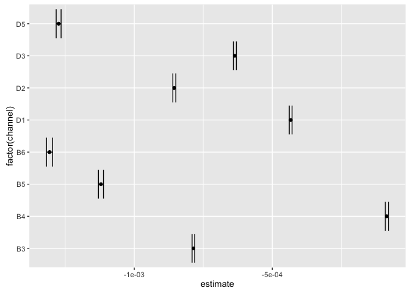

# Daph_Resp

#### Load libraries

```r
library(readr)
library(ggplot2)
library(tidyr)
library(dplyr)
library(broom)
```

#### Import data

```r
resp12 <- read_csv("respirometry-data/daph_resp_april29.csv")
resp20 <- read_csv("respirometry-data/daph_resp_april28.csv")
resp20_weights <- read_csv("respirometry-data/Daph_resp_weights_April28.csv")


#### Turn into long form
resp.long12 <- gather(resp12, channel, oxygen, 3:25)
resp.long20 <- gather(resp20, channel, oxygen, 3:25)

#### create new column with test temperature
resp.long20$temperature <- 20
resp.long12$temperature <- 12

#### fiddle with the time column so that it's reported in seconds, as a numeric variable
## this is going to be the dependent variable in my regressions
resp.long20$time <- as.numeric(resp.long20$`Time/Sec.`)
resp.long12$time <- as.numeric(resp.long12$`Time/Sec.`)


#### merge the two datasets
resp <- bind_rows(resp.long20, resp.long12)
resp$temperature <- as.factor(resp$temperature)
```


#### Initial Plots

```r
## 12C plots
ggplot(data = resp.long12, aes(x = time, y = oxygen)) + geom_point() + facet_wrap( ~ channel)
```

<!-- -->

```r
## 20C plots
ggplot(data = resp.long20, aes(x = time, y = oxygen)) + geom_point() +
	stat_summary(fun.y= "mean", geom = "point") +
	geom_smooth(method = 'lm') + 
	facet_wrap( ~ channel)
```

<!-- -->

```r
#### Density plot of de-oxygenated water, to compare the readings at 12 and 20C
#### look specifically at wells A1 and A2, these are the deoxygenated water
resp %>% 
	ggplot(data = ., aes(x=oxygen)) + geom_density(aes(group=temperature, colour=temperature, fill=temperature), alpha=0.3) + facet_wrap( ~ channel, scales = "free")
```

<!-- -->


#### Calculate slopes to get oxygen consumption (here for 20C run only)

```r
control.slopes <- resp.long20 %>% 
	filter(channel %in% c("A3", "A4", "A5", "A6")) %>% ## I'm filtering out only the A row, b/c these were my plain COMBO wells
	group_by(channel) %>% 
	filter(time < 3600 & time > 300) %>% ## here I filter out the chunk of time between 5 minutes and one hour
	do(tidy(lm(oxygen ~ time, data = .), conf.int = TRUE)) %>% ## here I fit a linear model of oxygen concentration as a function of time, for each well
	filter(term != "(Intercept)") %>% ## get rid of the intercept estimate
	summarise(mean.slope = mean(estimate)) ## create a new column for the mean slope

mean.control.slope <- mean(control.slopes$mean.slope) ## calculate the mean control slope
```
#### Calculate and manipulate daphnia respiration slopes (want to eventually end up in units of mg O2/hr)

```r
slopes <- resp.long20 %>% 
	filter(channel %in% c("D1", "D2", "D3", "D5", "B3", "B4", "B5", "B6", "C5")) %>% ## pull out the wells where it looks like the measurements worked
	group_by(channel) %>% 
	filter(time < 3600 & time > 300) %>% ## select time chunk
	do(tidy(lm(oxygen ~ time, data = .), conf.int = TRUE)) %>% ## fit linear models, grouped by channel
	filter(term != "(Intercept)") %>% ## get rid of intercept term
	## create new variable, called "microbe.corr.slope" in which I subtract the mean of the COMBO only slopes, correcting for microbial respiration
	## now units are mg O2 / L*s
	mutate(microbe.corr.slope = estimate - mean.control.slope) %>% 
	## now multiply the mg O2 /L*s by 0.0002L, which is the volume of the wells, and by 3600s, to convert my metric in seconds to hours
	## and finally, multiply by -1 to convert negative concentrations to a positive respiration value
	## units should now be mg O2/hr
	mutate(cons_per_hour = ((microbe.corr.slope * 0.0002 *3600) * -1)) 
```

#### Bring in the Daphnia weights, left join with the slope estimates

```r
mass_slopes <- left_join(slopes, resp20_weights, by = "channel")
```
#### Get mass-specific respiration rates
##### take the respiration rates (in mg O2/hr) and divide by daphnia weights
##### scroll all the way to the right to see the mass corrected consumption, which should be in mg O2/mg dry weight * hour

```r
mass_slopes %>% 
	mutate(mass.corr.cons = (cons_per_hour/daph_minus_water)) %>% 
knitr::kable(., align = 'c', format = 'markdown', digits = 4)
```


| channel | term | estimate | std.error | statistic | p.value | conf.low | conf.high | microbe.corr.slope | cons_per_hour | Before  |  After  | daph_plus_water | water | mean_water | daph_minus_water | mass.corr.cons |
|:-------:|:----:|:--------:|:---------:|:---------:|:-------:|:--------:|:---------:|:------------------:|:-------------:|:-------:|:-------:|:---------------:|:-----:|:----------:|:----------------:|:--------------:|
|   B3    | time | -0.0008  |     0     | -328.8470 |    0    | -0.0008  |  -0.0008  |      -0.0008       |     6e-04     | 54.9625 | 54.9860 |     0.0235      |  NA   |   0.0192   |      0.0043      |     0.1350     |
|   B4    | time | -0.0001  |     0     | -29.0144  |    0    | -0.0001  |  -0.0001  |      -0.0001       |     1e-04     | 54.6966 | 54.7734 |     0.0768      |  NA   |   0.0192   |      0.0576      |     0.0014     |
|   B5    | time | -0.0011  |     0     | -242.6473 |    0    | -0.0011  |  -0.0011  |      -0.0011       |     8e-04     | 54.1293 | 54.2196 |     0.0903      |  NA   |   0.0192   |      0.0711      |     0.0116     |
|   B6    | time | -0.0013  |     0     | -233.9096 |    0    | -0.0013  |  -0.0013  |      -0.0013       |     1e-03     | 54.9597 | 55.0578 |     0.0981      |  NA   |   0.0192   |      0.0789      |     0.0122     |
|   C5    | time | -0.0012  |     0     | -330.1098 |    0    | -0.0012  |  -0.0012  |      -0.0012       |     9e-04     | 55.1164 | 55.2048 |     0.0884      |  NA   |   0.0192   |      0.0692      |     0.0124     |
|   D1    | time | -0.0004  |     0     | -169.5780 |    0    | -0.0004  |  -0.0004  |      -0.0005       |     3e-04     | 53.8989 | 53.9971 |     0.0982      |  NA   |   0.0192   |      0.0790      |     0.0042     |
|   D2    | time | -0.0009  |     0     | -313.0999 |    0    | -0.0009  |  -0.0008  |      -0.0009       |     6e-04     | 54.8825 | 54.9861 |     0.1036      |  NA   |   0.0192   |      0.0844      |     0.0075     |
|   D3    | time | -0.0006  |     0     | -231.2268 |    0    | -0.0006  |  -0.0006  |      -0.0007       |     5e-04     | 53.4927 | 53.5525 |     0.0598      |  NA   |   0.0192   |      0.0406      |     0.0117     |
|   D5    | time | -0.0013  |     0     | -282.2734 |    0    | -0.0013  |  -0.0013  |      -0.0013       |     9e-04     | 54.0971 | 54.1878 |     0.0907      |  NA   |   0.0192   |      0.0715      |     0.0131     |

#### Visualize the slopes estimates in a coefficient plot

```r
resp.long20 %>% 
	filter(channel %in% c("D1", "D2", "D3", "D5", "B3", "B4", "B5", "B6")) %>% 
	group_by(channel) %>% 
	filter(time < 3600 & time > 300) %>% 
	do(tidy(lm(oxygen ~ time, data = .), conf.int = TRUE)) %>%
	filter(term != "(Intercept)") %>% 
	ggplot(aes(y = estimate, x = factor(channel))) + geom_point() + 
	coord_flip() +
	geom_vline(xintercept = 0) +
	geom_errorbar(aes(ymin = conf.low, ymax = conf.high)) 
```

<!-- -->
