# Daph_Resp

#### Load libraries

```r
library(readr)
library(ggplot2)
library(tidyr)
library(dplyr)
library(broom)
library(plotrix)
```

#### Import data

```r
resp12 <- read_csv("respirometry-data/daph_resp_april29.csv")
resp20 <- read_csv("respirometry-data/daph_resp_april28.csv")
resp20_weights <- read_csv("respirometry-data/May5_20C_resp_weights.csv") %>% 
	mutate(temperature = 20)
resp12_weights <- read_csv("respirometry-data/May6_12C_resp_weights.csv") %>% 
	mutate(temperature = 12)
resp24_weights <- read_csv("respirometry-data/May5_24C_resp_weights.csv") %>% 
	mutate(temperature = 24)
resp16_weights <- read_csv("respirometry-data/May6_16C_resp_weights.csv") %>% 
	mutate(temperature = 16)

# resp_20 <- read_delim("respirometry-data/May5-24-R3-RESP_Oxygen.txt",delim = ";", na = c("", "NA"), comment = "", skip = 34)

resp24 <- read_csv("respirometry-data/May5-24-resp.csv")
resp20 <- read_csv("respirometry-data/May5-20-resp.csv")
resp16 <- read_csv("respirometry-data/May6-16-resp.csv")
resp12 <- read_csv("respirometry-data/May6-12-resp.csv")


#### Turn into long form
resp.long12 <- gather(resp12, channel, oxygen, 3:25)
resp.long20 <- gather(resp20, channel, oxygen, 3:25)
resp.long24 <- gather(resp24, channel, oxygen, 3:25)
resp.long16 <- gather(resp16, channel, oxygen, 3:25)
#### create new column with test temperature
resp.long20$temperature <- 20
resp.long12$temperature <- 12
resp.long24$temperature <- 24
resp.long16$temperature <- 16
#### fiddle with the time column so that it's reported in seconds, as a numeric variable
## this is going to be the dependent variable in my regressions
resp.long20$time <- as.numeric(resp.long20$time)
resp.long12$time <- as.numeric(resp.long12$time)
resp.long24$time <- as.numeric(resp.long24$time)
resp.long16$time <- as.numeric(resp.long16$time)

#### merge the two datasets
resp <- bind_rows(resp.long20, resp.long12, resp.long24, resp.long16)
resp$temperature <- as.factor(resp$temperature)
```


#### Initial Plots

```r
weights <- bind_rows(resp12_weights, resp16_weights, resp20_weights, resp24_weights) %>% 
	mutate(temperature = as.factor(temperature))

g <- ggplot(weights, aes(daph_weight)) + geom_histogram(binwidth = 0.009)
g + facet_grid(temperature ~ ., scales = "free_y") + theme_bw() 
```

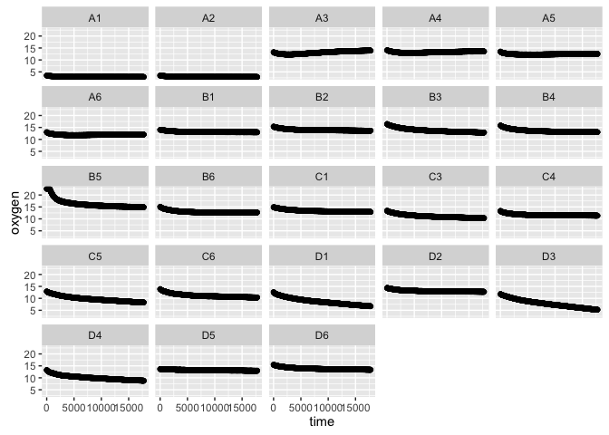<!-- -->

```r
mean_daph_weight <- mean(weights$daph_weight)

weights %>% 
	group_by(temperature) %>% 
	select(daph_weight, temperature) %>% 
# 	summarize(mean = mean(mass.corr.cons),
# 						sd = sd(mass.corr.cons)) %>% 
	summarise_each(funs(mean,median, sd,std.error)) %>% 
	ggplot(data = ., aes(temperature, y = mean)) +
	geom_errorbar(aes(ymin=mean-std.error, ymax=mean+std.error), width=.1) +
    geom_point()
```

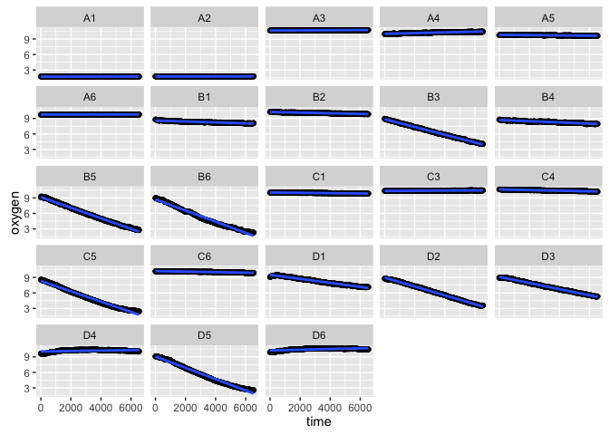<!-- -->

```r
resp.long16 %>%
	group_by(temperature) %>% 
	filter(time > 300 & time < 2000) %>% 
	ggplot(data = ., aes(x = time, y = oxygen, group = temperature, color = temperature)) + geom_point() + stat_summary(fun.y= "mean", geom = "point") +
	geom_smooth(method = 'lm')
```

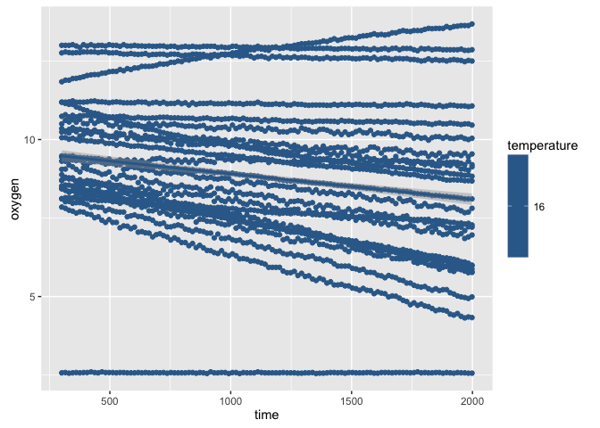<!-- -->

```r
## 12C plots
resp.long12 %>% 
	ggplot(data = ., aes(x = time, y = oxygen)) + geom_point() 
```

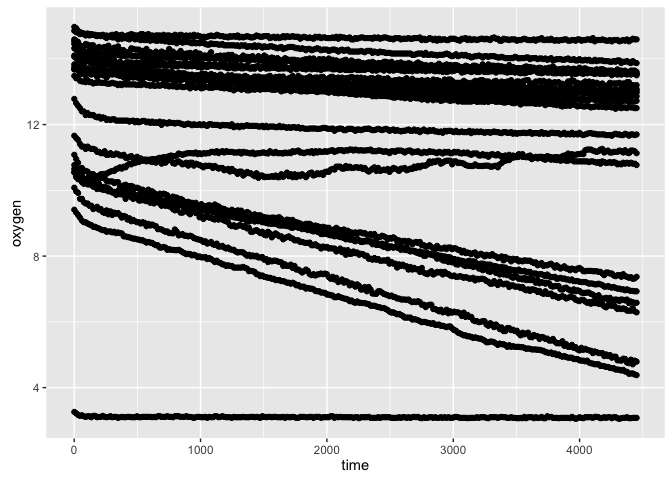<!-- -->

```r
resp.long24 %>% 
	filter(time > 300 & time < 2000) %>% 
	ggplot(data = ., aes(x = time, y = oxygen)) + geom_point() + stat_summary(fun.y= "mean", geom = "point") +
	geom_smooth(method = 'lm') + 
	facet_wrap( ~ channel)
```

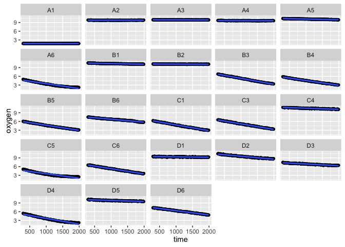<!-- -->

```r
ggplot(data = resp.long24, aes(x = time, y = oxygen)) + geom_point() + facet_wrap( ~ channel)
```

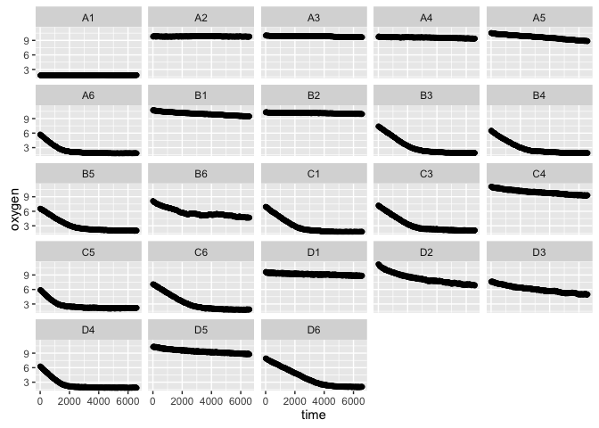<!-- -->

```r
## 20C plots
ggplot(data = resp.long20, aes(x = time, y = oxygen)) + geom_point() +
	stat_summary(fun.y= "mean", geom = "point") +
	geom_smooth(method = 'lm') + 
	facet_wrap( ~ channel)
```

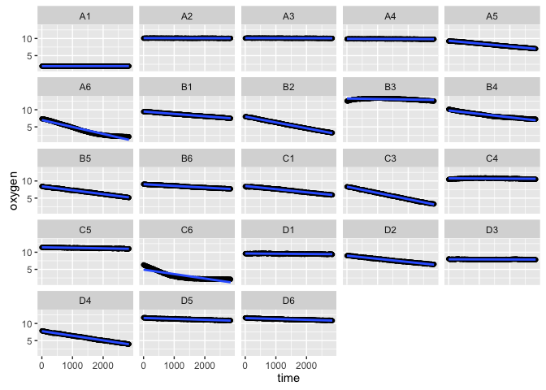<!-- -->

```r
#### Density plot of de-oxygenated water, to compare the readings at 12 and 20C
#### look specifically at wells A1 and A2, these are the deoxygenated water
resp %>% 
	ggplot(data = ., aes(x=oxygen)) + geom_density(aes(group=temperature, colour=temperature, fill=temperature), alpha=0.3) + facet_wrap( ~ channel, scales = "free")
```

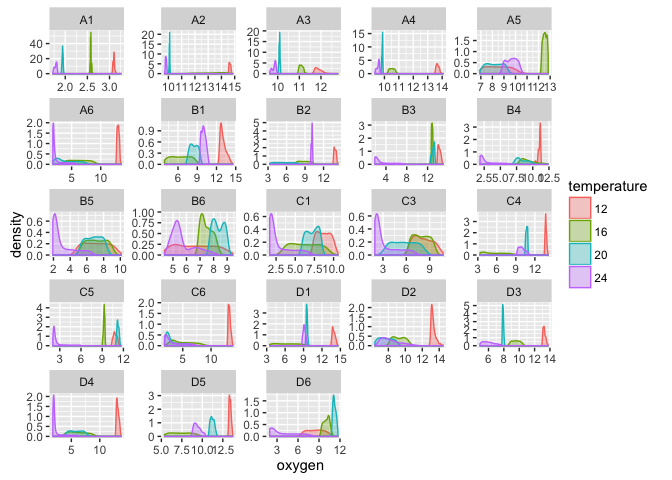<!-- -->


#### Calculate slopes to get oxygen consumption (here for 20C run only)

```r
control.slopes20 <- resp.long20 %>% 
	filter(channel %in% c("A2", "A3", "A4")) %>% ## I'm filtering out only the A row, b/c these were my plain COMBO wells
	group_by(channel) %>% 
	filter(time < 2000 & time > 300) %>% ## here I filter out the chunk of time between 5 minutes and one hour
	do(tidy(lm(oxygen ~ time, data = .), conf.int = TRUE)) %>% ## here I fit a linear model of oxygen concentration as a function of time, for each well
	filter(term != "(Intercept)") %>% ## get rid of the intercept estimate
	summarise(mean.slope = mean(estimate)) ## create a new column for the mean slope

mean.control.slope20 <- mean(control.slopes20$mean.slope) ## calculate the mean control slope
```
#### Calculate and manipulate daphnia respiration slopes (want to eventually end up in units of mg O2/hr)

```r
slopes20 <- resp.long20 %>% 
	filter(channel %in% c("A6", "B2", "B4", "B5", "C1", "C3", "C6", "D2", "D4")) %>% ## pull out the wells where it looks like the measurements worked
	group_by(channel) %>% 
	filter(time < 2000 & time > 300) %>% ## select time chunk
	do(tidy(lm(oxygen ~ time, data = .), conf.int = TRUE)) %>% ## fit linear models, grouped by channel
	filter(term != "(Intercept)") %>% ## get rid of intercept term
	## create new variable, called "microbe.corr.slope" in which I subtract the mean of the COMBO only slopes, correcting for microbial respiration
	## now units are mg O2 / L*s
	mutate(microbe.corr.slope = estimate - mean.control.slope20) %>% 
	## now multiply the mg O2 /L*s by 0.0002L, which is the volume of the wells, and by 3600s, to convert my metric in seconds to hours
	## and finally, multiply by -1 to convert negative concentrations to a positive respiration value
	## units should now be mg O2/hr
	mutate(cons_per_hour = ((microbe.corr.slope * 0.0002 *3600) * -1)) 
```

#### Bring in the Daphnia weights, left join with the slope estimates

```r
mass_slopes20 <- left_join(slopes20, resp20_weights, by = "channel")
```
#### Get mass-specific respiration rates
##### take the respiration rates (in mg O2/hr) and divide by daphnia weights
##### scroll all the way to the right to see the mass corrected consumption, which should be in mg O2/mg dry weight * hour

```r
mass_slopes20 %>% 
	mutate(mass.corr.cons = (cons_per_hour/daph_weight)) %>%
knitr::kable(., align = 'c', format = 'markdown', digits = 4)
```


| channel | term | estimate | std.error | statistic | p.value | conf.low | conf.high | microbe.corr.slope | cons_per_hour | difference | water_weight | daph_weight | daph_weight_median | daph_weight_median_no | temperature | mass.corr.cons |
|:-------:|:----:|:--------:|:---------:|:---------:|:-------:|:--------:|:---------:|:------------------:|:-------------:|:----------:|:------------:|:-----------:|:------------------:|:---------------------:|:-----------:|:--------------:|
|   A6    | time | -0.0026  |   0e+00   | -140.3374 |    0    | -0.0026  |  -0.0025  |      -0.0025       |    0.0018     |   0.3304   |    0.089     |   0.2414    |       0.0746       |        0.0723         |     20      |     0.0076     |
|   B2    | time | -0.0018  |   0e+00   | -348.9787 |    0    | -0.0018  |  -0.0017  |      -0.0017       |    0.0012     |   0.2306   |    0.089     |   0.1417    |       0.0746       |        0.0723         |     20      |     0.0088     |
|   B4    | time | -0.0012  |   0e+00   | -87.1605  |    0    | -0.0012  |  -0.0012  |      -0.0012       |    0.0008     |   0.1897   |    0.089     |   0.1007    |       0.0746       |        0.0723         |     20      |     0.0083     |
|   B5    | time | -0.0011  |   0e+00   | -136.0967 |    0    | -0.0011  |  -0.0011  |      -0.0011       |    0.0008     |   0.1392   |    0.089     |   0.0502    |       0.0746       |        0.0723         |     20      |     0.0155     |
|   C1    | time | -0.0009  |   0e+00   | -83.6078  |    0    | -0.0009  |  -0.0009  |      -0.0009       |    0.0006     |   0.1096   |    0.089     |   0.0207    |       0.0746       |        0.0723         |     20      |     0.0314     |
|   C3    | time | -0.0018  |   0e+00   | -197.8243 |    0    | -0.0019  |  -0.0018  |      -0.0018       |    0.0013     |   0.1659   |    0.089     |   0.0769    |       0.0746       |        0.0723         |     20      |     0.0170     |
|   C6    | time | -0.0017  |   1e-04   | -26.6250  |    0    | -0.0018  |  -0.0016  |      -0.0017       |    0.0012     |   0.3090   |    0.089     |   0.2200    |       0.0746       |        0.0723         |     20      |     0.0054     |
|   D2    | time | -0.0010  |   0e+00   | -91.8299  |    0    | -0.0010  |  -0.0009  |      -0.0009       |    0.0007     |   0.2284   |    0.089     |   0.1394    |       0.0746       |        0.0723         |     20      |     0.0049     |
|   D4    | time | -0.0014  |   0e+00   | -122.8279 |    0    | -0.0014  |  -0.0014  |      -0.0014       |    0.0010     |   0.2035   |    0.089     |   0.1145    |       0.0746       |        0.0723         |     20      |     0.0085     |

#### 12C
#### Calculate and manipulate daphnia respiration slopes (want to eventually end up in units of mg O2/hr)

```r
control.slopes12 <- resp.long12 %>% 
	filter(channel %in% c("A2", "A3", "A4")) %>% ## I'm filtering out only the A row, b/c these were my plain COMBO wells
	group_by(channel) %>% 
	filter(time < 2000 & time > 300) %>% ## here I filter out the chunk of time between 5 minutes and one hour
	do(tidy(lm(oxygen ~ time, data = .), conf.int = TRUE)) %>% ## here I fit a linear model of oxygen concentration as a function of time, for each well
	filter(term != "(Intercept)") %>% ## get rid of the intercept estimate
	summarise(mean.slope = mean(estimate)) ## create a new column for the mean slope

mean.control.slope12 <- mean(control.slopes12$mean.slope) ## calculate the mean control slope


slopes12 <- resp.long12 %>% 
	filter(channel %in% c("A5", "B1", "B5", "B6", "C1", "C3", "D6")) %>% ## pull out the wells where it looks like the measurements worked
	group_by(channel) %>% 
	filter(time < 3600 & time > 300) %>% ## select time chunk
	do(tidy(lm(oxygen ~ time, data = .), conf.int = TRUE)) %>% ## fit linear models, grouped by channel
	filter(term != "(Intercept)") %>% ## get rid of intercept term
	## create new variable, called "microbe.corr.slope" in which I subtract the mean of the COMBO only slopes, correcting for microbial respiration
	## now units are mg O2 / L*s
	mutate(microbe.corr.slope = estimate - mean.control.slope12) %>% 
	## now multiply the mg O2 /L*s by 0.0002L, which is the volume of the wells, and by 3600s, to convert my metric in seconds to hours
	## and finally, multiply by -1 to convert negative concentrations to a positive respiration value
	## units should now be mg O2/hr
	mutate(cons_per_hour = ((microbe.corr.slope * 0.0002 *3600) * -1)) 
```

#### Bring in the Daphnia weights, left join with the slope estimates

```r
mass_slopes12 <- left_join(slopes12, resp12_weights, by = "channel")
```

#### 24C
#### Calculate and manipulate daphnia respiration slopes (want to eventually end up in units of mg O2/hr)

```r
control.slopes24 <- resp.long24 %>% 
	filter(channel %in% c("A2", "A3", "A4")) %>% ## I'm filtering out only the A row, b/c these were my plain COMBO wells
	group_by(channel) %>% 
	filter(time < 2000 & time > 300) %>% ## here I filter out the chunk of time between 5 minutes and one hour
	do(tidy(lm(oxygen ~ time, data = .), conf.int = TRUE)) %>% ## here I fit a linear model of oxygen concentration as a function of time, for each well
	filter(term != "(Intercept)") %>% ## get rid of the intercept estimate
	summarise(mean.slope = mean(estimate)) ## create a new column for the mean slope

mean.control.slope24 <- mean(control.slopes24$mean.slope) ## calculate the mean control slope


slopes24 <- resp.long24 %>% 
	filter(channel %in% c("A6", "B3", "B4", "B5", "B6", "C1", "C3", "C5", "C6", "D3", "D4")) %>% ## pull out the wells where it looks like the measurements worked
	group_by(channel) %>% 
	filter(time < 2000 & time > 300) %>% ## select time chunk
	do(tidy(lm(oxygen ~ time, data = .), conf.int = TRUE)) %>% ## fit linear models, grouped by channel
	filter(term != "(Intercept)") %>% ## get rid of intercept term
	## create new variable, called "microbe.corr.slope" in which I subtract the mean of the COMBO only slopes, correcting for microbial respiration
	## now units are mg O2 / L*s
	mutate(microbe.corr.slope = estimate - mean.control.slope24) %>% 
	## now multiply the mg O2 /L*s by 0.0002L, which is the volume of the wells, and by 3600s, to convert my metric in seconds to hours
	## and finally, multiply by -1 to convert negative concentrations to a positive respiration value
	## units should now be mg O2/hr
	mutate(cons_per_hour = ((microbe.corr.slope * 0.0002 *3600) * -1)) 
```

#### Bring in the Daphnia weights, left join with the slope estimates

```r
mass_slopes24 <- left_join(slopes24, resp24_weights, by = "channel")
```
#### Get mass-specific respiration rates
##### take the respiration rates (in mg O2/hr) and divide by daphnia weights
##### scroll all the way to the right to see the mass corrected consumption, which should be in mg O2/mg dry weight * hour

```r
mass_slopes24 %>% 
	mutate(mass.corr.cons = (cons_per_hour/daph_weight)) %>%
knitr::kable(., align = 'c', format = 'markdown', digits = 4)
```


| channel | term | estimate | std.error | statistic | p.value | conf.low | conf.high | microbe.corr.slope | cons_per_hour | difference | water_weight | daph_weight | daph_weight_median | temperature | mass.corr.cons |
|:-------:|:----:|:--------:|:---------:|:---------:|:-------:|:--------:|:---------:|:------------------:|:-------------:|:----------:|:------------:|:-----------:|:------------------:|:-----------:|:--------------:|
|   A6    | time | -0.0017  |     0     | -55.8658  |    0    | -0.0017  |  -0.0016  |      -0.0017       |    0.0012     |   0.1786   |    0.0984    |   0.0802    |       0.0802       |     24      |     0.0150     |
|   B3    | time | -0.0020  |     0     | -239.4969 |    0    | -0.0021  |  -0.0020  |      -0.0020       |    0.0015     |   0.1182   |    0.0984    |   0.0198    |       0.0802       |     24      |     0.0738     |
|   B4    | time | -0.0017  |     0     | -180.8717 |    0    | -0.0017  |  -0.0016  |      -0.0017       |    0.0012     |   0.1544   |    0.0984    |   0.0560    |       0.0802       |     24      |     0.0212     |
|   B5    | time | -0.0018  |     0     | -151.7120 |    0    | -0.0018  |  -0.0017  |      -0.0017       |    0.0013     |   0.1763   |    0.0984    |   0.0779    |       0.0802       |     24      |     0.0161     |
|   B6    | time | -0.0010  |     0     | -97.9765  |    0    | -0.0010  |  -0.0010  |      -0.0010       |    0.0007     |   0.1884   |    0.0984    |   0.0900    |       0.0802       |     24      |     0.0079     |
|   C1    | time | -0.0020  |     0     | -171.5911 |    0    | -0.0020  |  -0.0020  |      -0.0020       |    0.0014     |   0.1612   |    0.0984    |   0.0628    |       0.0802       |     24      |     0.0226     |
|   C3    | time | -0.0019  |     0     | -183.7259 |    0    | -0.0019  |  -0.0019  |      -0.0019       |    0.0014     |   0.1460   |    0.0984    |   0.0476    |       0.0802       |     24      |     0.0286     |
|   C5    | time | -0.0016  |     0     | -38.1082  |    0    | -0.0016  |  -0.0015  |      -0.0015       |    0.0011     |   0.1879   |    0.0984    |   0.0895    |       0.0802       |     24      |     0.0124     |
|   C6    | time | -0.0018  |     0     | -177.9725 |    0    | -0.0018  |  -0.0018  |      -0.0018       |    0.0013     |   0.1517   |    0.0984    |   0.0533    |       0.0802       |     24      |     0.0242     |
|   D3    | time | -0.0006  |     0     | -50.9590  |    0    | -0.0006  |  -0.0006  |      -0.0006       |    0.0004     |   0.2124   |    0.0984    |   0.1140    |       0.0802       |     24      |     0.0037     |
|   D4    | time | -0.0020  |     0     | -59.4464  |    0    | -0.0021  |  -0.0019  |      -0.0020       |    0.0014     |   0.2108   |    0.0984    |   0.1124    |       0.0802       |     24      |     0.0128     |

#### 16C
#### Calculate and manipulate daphnia respiration slopes (want to eventually end up in units of mg O2/hr)

```r
control.slopes16 <- resp.long16 %>% 
	filter(channel %in% c("A3", "A4")) %>% ## I'm filtering out only the A row, b/c these were my plain COMBO wells
	group_by(channel) %>% 
	filter(time < 2000 & time > 300) %>% ## here I filter out the chunk of time between 5 minutes and one hour
	do(tidy(lm(oxygen ~ time, data = .), conf.int = TRUE)) %>% ## here I fit a linear model of oxygen concentration as a function of time, for each well
	filter(term != "(Intercept)") %>% ## get rid of the intercept estimate
	summarise(mean.slope = mean(estimate)) ## create a new column for the mean slope

mean.control.slope16 <- mean(control.slopes16$mean.slope) ## calculate the mean control slope


slopes16 <- resp.long16 %>% 
	filter(channel %in% c("A6", "B1", "B4", "B5", "B6", "C1", "C3", "C4", "C6", "D1", "D2", "D4", "D5")) %>% ## pull out the wells where it looks like the measurements worked
	group_by(channel) %>% 
	filter(time < 2000 & time > 300) %>% ## select time chunk
	do(tidy(lm(oxygen ~ time, data = .), conf.int = TRUE)) %>% ## fit linear models, grouped by channel
	filter(term != "(Intercept)") %>% ## get rid of intercept term
	## create new variable, called "microbe.corr.slope" in which I subtract the mean of the COMBO only slopes, correcting for microbial respiration
	## now units are mg O2 / L*s
	mutate(microbe.corr.slope = estimate - mean.control.slope16) %>% 
	## now multiply the mg O2 /L*s by 0.0002L, which is the volume of the wells, and by 3600s, to convert my metric in seconds to hours
	## and finally, multiply by -1 to convert negative concentrations to a positive respiration value
	## units should now be mg O2/hr
	mutate(cons_per_hour = ((microbe.corr.slope * 0.0002 *3600) * -1)) 
```

#### Bring in the Daphnia weights, left join with the slope estimates

```r
mass_slopes16 <- left_join(slopes16, resp16_weights, by = "channel")
```


#### Get mass-specific respiration rates
##### take the respiration rates (in mg O2/hr) and divide by daphnia weights
##### scroll all the way to the right to see the mass corrected consumption, which should be in mg O2/mg dry weight * hour

```r
mass_slopes12 %>% 
	mutate(mass.corr.cons = (cons_per_hour/daph_weight_median)) %>%
knitr::kable(., align = 'c', format = 'markdown', digits = 4)
```


| channel | term | estimate | std.error | statistic | p.value | conf.low | conf.high | microbe.corr.slope | cons_per_hour | difference | water_weight | daph_weight | daph_weight_median | temperature | mass.corr.cons |
|:-------:|:----:|:--------:|:---------:|:---------:|:-------:|:--------:|:---------:|:------------------:|:-------------:|:----------:|:------------:|:-----------:|:------------------:|:-----------:|:--------------:|
|   A5    | time | -0.0007  |     0     | -489.8015 |    0    | -0.0007  |  -0.0007  |       -6e-04       |     5e-04     |   0.2636   |    0.0984    |   0.1652    |       0.0802       |     12      |     0.0058     |
|   B1    | time | -0.0003  |     0     | -60.0511  |    0    | -0.0004  |  -0.0003  |       -3e-04       |     2e-04     |   0.1476   |    0.0984    |   0.0493    |       0.0802       |     12      |     0.0023     |
|   B5    | time | -0.0011  |     0     | -372.2289 |    0    | -0.0011  |  -0.0011  |       -1e-03       |     7e-04     |   0.1763   |    0.0984    |   0.0779    |       0.0802       |     12      |     0.0092     |
|   B6    | time | -0.0011  |     0     | -482.2223 |    0    | -0.0011  |  -0.0011  |       -1e-03       |     7e-04     |   0.1884   |    0.0984    |   0.0900    |       0.0802       |     12      |     0.0091     |
|   C1    | time | -0.0007  |     0     | -264.9343 |    0    | -0.0007  |  -0.0007  |       -6e-04       |     4e-04     |   0.1612   |    0.0984    |   0.0628    |       0.0802       |     12      |     0.0051     |
|   C3    | time | -0.0009  |     0     | -172.3998 |    0    | -0.0009  |  -0.0009  |       -8e-04       |     6e-04     |   0.1460   |    0.0984    |   0.0476    |       0.0802       |     12      |     0.0074     |
|   D6    | time | -0.0009  |     0     | -309.0592 |    0    | -0.0009  |  -0.0009  |       -8e-04       |     6e-04     |   0.1827   |    0.0984    |   0.0843    |       0.0802       |     12      |     0.0071     |

```r
flux_12 <- mass_slopes12 %>% 
	mutate(mass.corr.cons = (cons_per_hour/daph_weight_median)) %>% 
	mutate(temperature = 12)

flux_20 <- mass_slopes20 %>% 
	mutate(mass.corr.cons = (cons_per_hour/daph_weight_median_no)) %>% 
	mutate(temperature = 20)

flux_24 <- mass_slopes24 %>% 
	mutate(mass.corr.cons = (cons_per_hour/daph_weight_median)) %>% 
	mutate(temperature = 24)


flux_16 <- mass_slopes16 %>% 
	mutate(mass.corr.cons = (cons_per_hour/daph_weight_median_no)) %>% 
	mutate(temperature = 16)

fluxes <- bind_rows(flux_20, flux_12, flux_24, flux_16) %>% 
	mutate(mass.corr.mean = (cons_per_hour/mean_daph_weight)) %>% 
	mutate(mass.corr.flux = (cons_per_hour/daph_weight))

library(plotrix)

#### respiration (divided by median mass of daphnia)
fluxes %>% 
	group_by(temperature) %>% 
	select(mass.corr.cons, temperature) %>% 
# 	summarize(mean = mean(mass.corr.cons),
# 						sd = sd(mass.corr.cons)) %>% 
	summarise_each(funs(mean,sd,std.error)) %>% 
	ggplot(data = ., aes(temperature, y = mean)) +
	geom_errorbar(aes(ymin=mean-std.error, ymax=mean+std.error), width=.1) +
    geom_point() + xlab("temperature, C") + ylab("oxygen flux (mg O2/L *mg DM)")
```

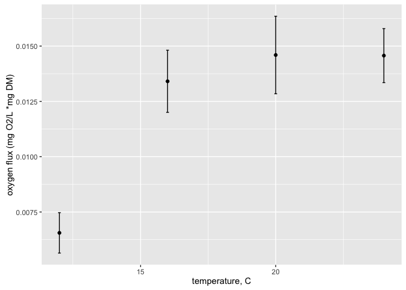<!-- -->

```r
#### respiration (divided by mean mass of daphnia)
fluxes %>% 
	group_by(temperature) %>% 
	select(mass.corr.mean, temperature) %>% 
# 	summarize(mean = mean(mass.corr.cons),
# 						sd = sd(mass.corr.cons)) %>% 
	summarise_each(funs(mean,sd,std.error)) %>% 
	ggplot(data = ., aes(temperature, y = mean)) +
	geom_errorbar(aes(ymin=mean-std.error, ymax=mean+std.error), width=.1) +
    geom_point() + xlab("temperature, C") + ylab("oxygen flux (mg O2/L *mg DM)")
```

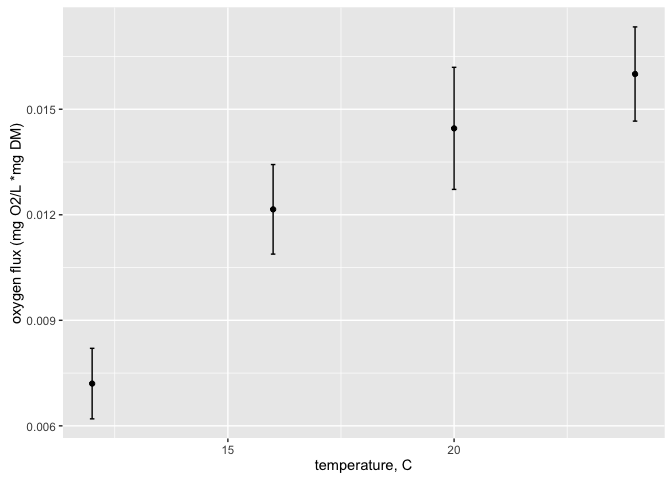<!-- -->

```r
mod1 <- lm(cons_per_hour ~ temperature, data = fluxes)
summary(mod1)
```

```
## 
## Call:
## lm(formula = cons_per_hour ~ temperature, data = fluxes)
## 
## Residuals:
##        Min         1Q     Median         3Q        Max 
## -7.949e-04 -1.857e-04  9.120e-06  2.087e-04  8.082e-04 
## 
## Coefficients:
##              Estimate Std. Error t value Pr(>|t|)    
## (Intercept) 3.326e-05  2.253e-04   0.148 0.883405    
## temperature 4.925e-05  1.193e-05   4.129 0.000192 ***
## ---
## Signif. codes:  0 '***' 0.001 '**' 0.01 '*' 0.05 '.' 0.1 ' ' 1
## 
## Residual standard error: 0.0003222 on 38 degrees of freedom
## Multiple R-squared:  0.3097,	Adjusted R-squared:  0.2916 
## F-statistic: 17.05 on 1 and 38 DF,  p-value: 0.000192
```

```r
ggplot(data = fluxes, aes(x = factor(temperature), y = mass.corr.mean, group = temperature, color = factor(temperature))) + geom_boxplot() + xlab("temperature, C") + ylab("oxygen flux (mg O2/L *mg DM)")
```

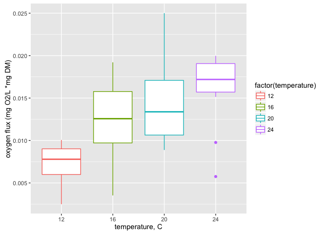<!-- -->

#### Visualize the slopes estimates in a coefficient plot


```r
resp.long20 %>% 
	filter(channel %in% c("D1", "D2", "D3", "D5", "B3", "B4", "B5", "B6")) %>% 
	group_by(channel) %>% 
	filter(time < 3600 & time > 300) %>% 
	do(tidy(lm(oxygen ~ time, data = .), conf.int = TRUE)) %>%
	filter(term != "(Intercept)") %>% 
	ggplot(aes(y = estimate, x = factor(channel))) + geom_point() + 
	coord_flip() +
	geom_vline(xintercept = 0) +
	geom_errorbar(aes(ymin = conf.low, ymax = conf.high)) 
```

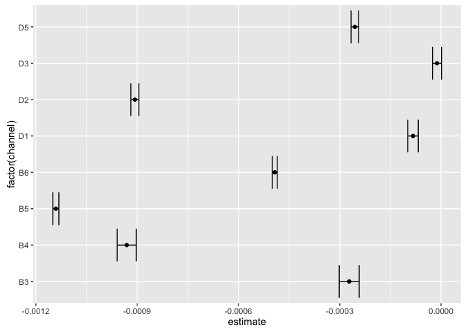<!-- -->
