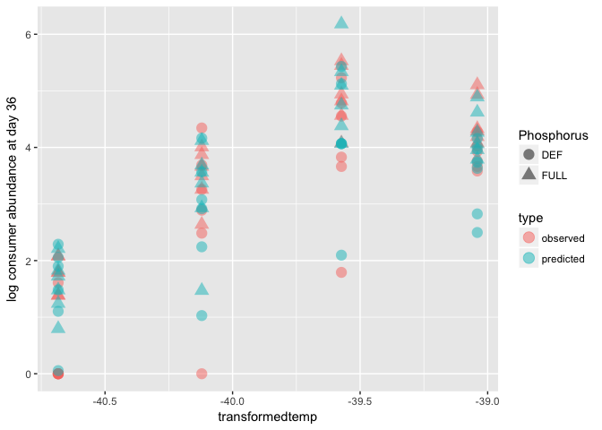

# CR-fitted-plots


```r
ggplot(data = data, aes(x = temp, y = log(r), group = Phosphorus, color = Phosphorus)) + geom_point()
```

<!-- -->


```r
data %>% 
	filter(temp < 24) %>% 
	mutate(inverse_temp = (1/(.00008617*(temp+273.15)))) %>% 
	group_by(Phosphorus) %>% 
	do(tidy(lm(log(K) ~ inverse_temp, data = .), conf.int = TRUE)) %>%
	filter(term != "(Intercept)") %>%
	ggplot(aes(x = Phosphorus, y = estimate)) + geom_point(size = 4) + 
	geom_errorbar(aes(ymin = conf.low, ymax = conf.high), width = 0.1)
```

<!-- -->


```r
data <- read_csv("/Users/Joey/Documents/p-temp/p-temp-marcus/plotdata.csv")
```

```
## Warning: Missing column names filled in: 'X1' [1]
```

```
## Parsed with column specification:
## cols(
##   X1 = col_integer(),
##   ID = col_integer(),
##   Phosphorus = col_character(),
##   transformedtemp = col_double(),
##   r = col_double(),
##   K = col_double(),
##   a = col_double(),
##   logobservedfinalP = col_double(),
##   logpredictedfinalP = col_double(),
##   logobservedfinalH = col_double(),
##   logpredictedfinalH = col_double()
## )
```


```r
	data %>% 
		gather(key = predicted_observed, value = abundance, 8:11) %>%
		mutate(type = ifelse(grepl("predicted", predicted_observed), "predicted", "observed")) %>% 
		mutate(trophic_level = ifelse(grepl("H$", predicted_observed), "consumer", "resource")) %>% 
		filter(trophic_level == "consumer") %>% 
		ggplot(aes(x = transformedtemp, y = abundance, color = type)) + geom_point(aes(shape = Phosphorus, fill = type), size = 4) + 
		scale_shape(solid = FALSE) + ylab("log consumer abundance at day 36")
```

<!-- -->


```r
	data %>% 
		gather(key = predicted_observed, value = abundance, 8:11) %>%
		mutate(type = ifelse(grepl("predicted", predicted_observed), "predicted", "observed")) %>% 
		mutate(trophic_level = ifelse(grepl("H$", predicted_observed), "consumer", "resource")) %>% 
		filter(trophic_level == "consumer") %>% 
		ggplot(aes(x = transformedtemp, y = abundance, color = Phosphorus)) + geom_point(aes(shape = type), size = 6, alpha = 0.5) + 
		# scale_shape(solid = FALSE) +
		ylab("log consumer abundance at day 36")
```

<!-- -->


```r
	data %>% 
		gather(key = predicted_observed, value = abundance, 8:11) %>%
		mutate(type = ifelse(grepl("predicted", predicted_observed), "predicted", "observed")) %>% 
		mutate(trophic_level = ifelse(grepl("H$", predicted_observed), "consumer", "resource")) %>% 
		filter(trophic_level == "resource") %>% 
		ggplot(aes(x = transformedtemp, y = abundance, color = type)) + geom_point(aes(shape = Phosphorus), size = 6, alpha = 0.5) + 
		# scale_shape(solid = FALSE) +
		ylab("log resource abundance at day 36")
```

<!-- -->
