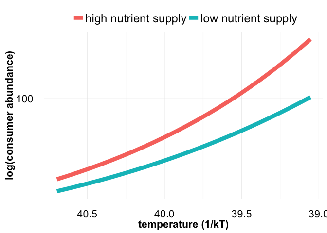
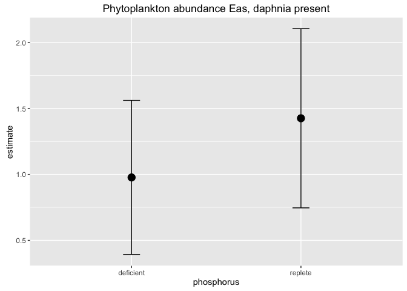

# P-TEMP results


### Background

Temperature effects on consumer-resource dynamics are predictable when resource supply is constant (O’Connor et al. 2011). However changes in nutrient supply to primary producers may occur simultaneously with warming. How variable nutrient supply modifies the temperature dependences of consumer and resource population abundances remains an open question. 

### We asked

_How does nutrient limitation affect the temperature dependences of consumer and resource growth rates and abundances?_

### We predicted

* increased maximum population growth rates and decreased carrying capacity as temperatures warm

* a linear change in nutrient supply should have larger effects on growth rates at high vs. low temperatures


```r
predictions <- read_csv("/Users/Joey/Documents/p-temp/data-processed/CR_abundances_30days.csv")
```


```r
predictions %>% 
	filter(temperature %in% c("12", "16", "20", "24")) %>% 
	ggplot(data = ., aes(x = time, y = P, color = factor(temperature))) +geom_point() +
	facet_wrap( ~ resource_level) +
	ylab("phytoplankton abundance") +
	xlab("time, days") + 
	ggtitle("resource density") +
	theme_minimal()
```

<!-- -->

```r
predictions %>% 
	filter(temperature %in% c("12", "16", "20", "24")) %>% 
	ggplot(data = ., aes(x = time, y = H, color = factor(temperature))) +geom_point() +
	facet_wrap( ~ resource_level) +
	ylab("consumer abundance") +
	xlab("time, days") + 
	ggtitle("consumer abundance") +
	theme_minimal()
```

<!-- -->

#### At day 30: 


```r
predictions %>% 
	filter(time == 30) %>% 
	mutate(inverse_temp = (1/(.00008617*(temperature+273.15)))) %>%
	ggplot(aes(x = inverse_temp, y = H, group = resource_level, color = resource_level)) + geom_line(size = 3) +
	scale_x_reverse() + 
	scale_y_log10() +
	theme_minimal() + xlab("temperature (1/kT)") + ylab("log(consumer abundance)") + 
	theme(axis.text=element_text(size=16),
				axis.title=element_text(size=16,face="bold")) +
	theme(legend.title=element_blank(),
				legend.text = element_text(size = 18)) +
	theme(legend.position="top")
```

<!-- -->


```r
predictions %>% 
	filter(time == 30) %>% 
	mutate(inverse_temp = (1/(.00008617*(temperature+273.15)))) %>%
	ggplot(aes(x = inverse_temp, y = P, group = resource_level, color = resource_level)) + geom_line(size = 3) +
	scale_x_reverse() + 
	scale_y_log10() +
	theme_minimal() + xlab("temperature (1/kT)") + ylab("log(consumer abundance)") + 
	theme(axis.text=element_text(size=16),
				axis.title=element_text(size=16,face="bold")) +
	theme(legend.title=element_blank(),
				legend.text = element_text(size = 18)) +
	theme(legend.position="top")
```

<!-- -->


### We found 


Load data

```r
# load data ---------------------------------------------------------------
ptemp <- read_csv("/Users/Joey/Documents/p-temp/data-processed/p_temp_processed.csv")
ptemp_algae <- read_csv("/Users/Joey/Documents/p-temp/data-processed/p_temp_algae.csv") 
algae_summaries <- read_csv("/Users/Joey/Documents/p-temp/data-processed/algae_summaries.csv")

### a bit of data prep
ptemp <- ptemp %>% 
	mutate(sample_date = mdy(sample_date))

ptemp$start.time <- ymd_hms("2016-03-30 14:15:43")
ptemp$time_since_innoc <- interval(ptemp$start.time, ptemp$sample_date)


ptemp <- ptemp %>% 
	mutate(time_since_innoc_days = time_since_innoc/ddays(1)) %>% 
	mutate(time_since_innoc_hours = time_since_innoc/dhours(1))
```


Phytoplankton populations over time


Phytoplankton populations over time (daphnia present)

```r
ptemp_algae %>% 
	filter(!grepl("C", replicate)) %>% 
	ggplot(data = ., aes(x = month_day, y = biovol, group = ID, color = factor(temp))) + geom_line(aes(linetype = P), size = 2) +
	facet_wrap( ~ temp) +
	scale_y_log10() +
	ylab("phytoplankton biovolume") +
	xlab("date") +
	ggtitle("Phytoplankton dynamics, with daphnia")
```

<!-- -->

Phytoplankton populations over time (daphnia absent)

```r
ptemp_algae %>% 
	filter(grepl("C", replicate)) %>% 
	ggplot(data = ., aes(x = month_day, y = biovol, group = ID, color = factor(temp))) + geom_line(aes(linetype = P), size = 2) +
	facet_wrap( ~ temp) +
	scale_y_log10() +
	ylab("phytoplankton biovolume") +
	xlab("date") +
	ggtitle("Phytoplankton dynamics, without daphnia")
```

<!-- -->

Phytoplankton maximum biovolume, over the entire experiment

```r
algae_summaries %>% 
	mutate(consumer = str_replace(consumer, "present", "daphnia present")) %>% 
		mutate(consumer = str_replace(consumer, "absent", "daphnia absent")) %>% 
	ggplot(data = ., aes(x = factor(temp), y = max, fill = factor(P))) + geom_boxplot() +
	# scale_y_log10() +
	facet_wrap( ~ consumer) +
	ylab("phytoplankton max biovolume")
```

<!-- -->

Activation energies of phytoplankton densities, a la Schoolfield


```r
current_dataset <- algae_summaries %>% 
	filter(P == "FULL", consumer == "absent") %>%
	select(max, temp) %>% 
	mutate(K = temp + 273.15) %>% 
	rename(OriginalTraitValue = max) %>% 
	select(-temp)

# ggplot(data = current_dataset_def, aes(x = K, y = OriginalTraitValue)) + geom_point()

current_dataset_def <- algae_summaries %>% 
	filter(P == "DEF", consumer == "absent") %>%
	select(max, temp) %>% 
	mutate(K = temp + 273.15) %>% 
	rename(OriginalTraitValue = max) %>% 
	select(-temp)
```


get starting values


```r
T.h.st  <- GetTpk(tmp=current_dataset$K, rate=current_dataset$OriginalTraitValue)
E.st    <- GetE(tmp=current_dataset$K, rate=current_dataset$OriginalTraitValue, T.p=T.h.st)
B.st <- GetB0(tmp=current_dataset$K, rate=current_dataset$OriginalTraitValue)


T.h.st_def  <- GetTpk(tmp=current_dataset_def$K, rate=current_dataset_def$OriginalTraitValue)
E.st_def    <- GetE(tmp=current_dataset_def$K, rate=current_dataset_def$OriginalTraitValue, T.p=T.h.st_def)
B.st_def <- GetB0(tmp=current_dataset_def$K, rate=current_dataset_def$OriginalTraitValue)
```

get schoolfield fit


```r
schoolfield_nls_full <- nlsLM(
	log(OriginalTraitValue) ~ Schoolfield(B0, E, E_D, T_h, temp = K), 
	start=c(B0 = B.st, E = E.st_def, E_D = 4*E.st, T_h=T.h.st),
	lower=c(B0=-Inf,   E=0,    E.D=0, Th=0),
	upper=c(B0=Inf,    E=Inf,  E.D=Inf, Th=273.15+150),
	data=current_dataset, control=list(minFactor=1 / 2^16, maxiter=1024))

schoolfield_nls_def <- nlsLM(
	log(OriginalTraitValue) ~ Schoolfield(B0, E, E_D, T_h, temp = K), 
	start=c(B0 = B.st_def, E = E.st_def, E_D = 4*E.st_def, T_h=T.h.st_def),
	lower=c(B0=-Inf,   E=0,    E.D=0, Th=0),
	upper=c(B0=Inf,    E=Inf,  E.D=Inf, Th=273.15+150),
	data=current_dataset_def, control=list(minFactor=1 / 2^16, maxiter=1024))

full_est <- tidy(schoolfield_nls_full) %>% 
	mutate(phosphorus = "replete")

def_est <- tidy(schoolfield_nls_def) %>% 
	mutate(phosphorus = "deficient")

all_estimates <- bind_rows(full_est, def_est) 
knitr::kable(all_estimates, align = 'c', format = 'markdown', digits = 2)
```


| term | estimate |  std.error  | statistic | p.value | phosphorus |
|:----:|:--------:|:-----------:|:---------:|:-------:|:----------:|
|  B0  |  18.70   |    0.23     |   83.09   |  0.00   |  replete   |
|  E   |   2.33   |    0.61     |   3.81    |  0.00   |  replete   |
| E_D  |  30.66   | 6811268.76  |   0.00    |  1.00   |  replete   |
| T_h  |  296.34  |  120175.67  |   0.00    |  1.00   |  replete   |
|  B0  |  18.86   |    0.47     |   39.86   |  0.00   | deficient  |
|  E   |   1.23   |    1.28     |   0.96    |  0.36   | deficient  |
| E_D  |  30.35   | 29459300.53 |   0.00    |  1.00   | deficient  |
| T_h  |  296.42  |  454263.62  |   0.00    |  1.00   | deficient  |

Plot the activation energies, daphnia absent


```r
all_estimates %>% 	
filter(term == "E") %>%
ggplot(aes(x = phosphorus, y = estimate, group = phosphorus)) + geom_point(size = 4) +
	geom_errorbar(aes(ymin = estimate - std.error, ymax = estimate + std.error), width = 0.1)
```

<!-- -->

Generate predictions from the model fit (non bootstrapped)


plot them!

```r
full_plot <- ggplot() + geom_point(data = DataToPlot, aes(x = Temperature, 
																						 y = TraitValue), size = 3, col = "black", bg = "lightcyan2", 
											alpha = 0.7, pch = 21) + 
	geom_line(data = ModelToPlotS, 
						aes(x = Temperature, y = TraitValue), colour = "#1b9e77", 
						lwd = 1.3) +                           
	ggtitle("Phosphorus replete") +
	xlab(expression(paste("Temperature (", degree, C, ")"))) + 
	ylab("max phytoplankton abundance") +
	theme_bw() + theme(plot.title = element_text(size = 16), 
										 axis.title = element_text(size = 16))

#### DEF
def_plot <- ggplot() + geom_point(data = DataToPlot_def, aes(x = Temperature, 
																						 y = TraitValue), size = 3, col = "black", bg = "lightcyan2", 
											alpha = 0.7, pch = 21) + 
	geom_line(data = ModelToPlotS_def, 
						aes(x = Temperature, y = TraitValue), colour = "#1b9e77", 
						lwd = 1.3) +                           
	ggtitle("Phosphorus deficient") +
	xlab(expression(paste("Temperature (", degree, C, ")"))) + 
	ylab("max phytoplankton abundance") +
	theme_bw() + theme(plot.title = element_text(size = 16), 
										 axis.title = element_text(size = 16)) + scale_y_log10()

grid.arrange(full_plot, def_plot, ncol = 2)
```

<!-- -->

Now with Daphnia present


```r
current_dataset <- algae_summaries %>% 
	filter(P == "FULL", consumer == "present") %>%
	select(max, temp) %>% 
	mutate(K = temp + 273.15) %>% 
	rename(OriginalTraitValue = max) %>% 
	select(-temp)

# ggplot(data = current_dataset_def, aes(x = K, y = OriginalTraitValue)) + geom_point()

current_dataset_def <- algae_summaries %>% 
	filter(P == "DEF", consumer == "present") %>%
	select(max, temp) %>% 
	mutate(K = temp + 273.15) %>% 
	rename(OriginalTraitValue = max) %>% 
	select(-temp)
```

get starting values


```r
T.h.st  <- GetTpk(tmp=current_dataset$K, rate=current_dataset$OriginalTraitValue)
E.st    <- GetE(tmp=current_dataset$K, rate=current_dataset$OriginalTraitValue, T.p=T.h.st)
B.st <- GetB0(tmp=current_dataset$K, rate=current_dataset$OriginalTraitValue)


T.h.st_def  <- GetTpk(tmp=current_dataset_def$K, rate=current_dataset_def$OriginalTraitValue)
E.st_def    <- GetE(tmp=current_dataset_def$K, rate=current_dataset_def$OriginalTraitValue, T.p=T.h.st_def)
B.st_def <- GetB0(tmp=current_dataset_def$K, rate=current_dataset_def$OriginalTraitValue)
```

get schoolfield fit


```r
schoolfield_nls_full <- nlsLM(
	log(OriginalTraitValue) ~ Schoolfield(B0, E, E_D, T_h, temp = K), 
	start=c(B0 = B.st, E = E.st_def, E_D = 4*E.st, T_h=T.h.st),
	lower=c(B0=-Inf,   E=0,    E.D=0, Th=0),
	upper=c(B0=Inf,    E=Inf,  E.D=Inf, Th=273.15+150),
	data=current_dataset, control=list(minFactor=1 / 2^16, maxiter=1024))

schoolfield_nls_def <- nlsLM(
	log(OriginalTraitValue) ~ Schoolfield(B0, E, E_D, T_h, temp = K), 
	start=c(B0 = B.st_def, E = E.st_def, E_D = 4*E.st_def, T_h=T.h.st_def),
	lower=c(B0=-Inf,   E=0,    E.D=0, Th=0),
	upper=c(B0=Inf,    E=Inf,  E.D=Inf, Th=273.15+150),
	data=current_dataset_def, control=list(minFactor=1 / 2^16, maxiter=1024))

full_est <- tidy(schoolfield_nls_full) %>% 
	mutate(phosphorus = "replete")

def_est <- tidy(schoolfield_nls_def) %>% 
	mutate(phosphorus = "deficient")

all_estimates <- bind_rows(full_est, def_est) 
knitr::kable(all_estimates, align = 'c', format = 'markdown', digits = 2)
```


| term | estimate | std.error  | statistic | p.value | phosphorus |
|:----:|:--------:|:----------:|:---------:|:-------:|:----------:|
|  B0  |  18.23   |    0.27    |   67.46   |  0.00   |  replete   |
|  E   |   1.43   |    0.68    |   2.10    |  0.05   |  replete   |
| E_D  |  31.36   | 1333951.40 |   0.00    |  1.00   |  replete   |
| T_h  |  295.74  |  49056.53  |   0.01    |  1.00   |  replete   |
|  B0  |  18.76   |    0.23    |   80.73   |  0.00   | deficient  |
|  E   |   0.98   |    0.58    |   1.67    |  0.11   | deficient  |
| E_D  |  31.36   | 982606.96  |   0.00    |  1.00   | deficient  |
| T_h  |  295.60  |  40392.43  |   0.01    |  0.99   | deficient  |

Plot the activation energies, daphnia present


```r
all_estimates %>% 	
filter(term == "E") %>%
ggplot(aes(x = phosphorus, y = estimate, group = phosphorus)) + geom_point(size = 4) +
	geom_errorbar(aes(ymin = estimate - std.error, ymax = estimate + std.error), width = 0.1) +
	ggtitle("Phytoplankton abundance Eas, daphnia present")
```

<!-- -->

Generate predictions from the model fit -- Daphnia present!


plot them!
<!-- -->


Now onto the Daphnia population abundances (at time final)


```r
current_dataset <- ptemp %>% 
	filter(date == "04-May", phosphorus_treatment == "FULL") %>% 
	select(daphnia_total, temperature) %>% 
	mutate(K = temperature + 273.15) %>% 
	rename(OriginalTraitValue = daphnia_total) %>% 
	select(-temperature)

current_dataset_def <- ptemp %>% 
	filter(date == "04-May", phosphorus_treatment == "DEF") %>% 
	select(daphnia_total, temperature) %>% 
	mutate(K = temperature + 273.15) %>% 
	rename(OriginalTraitValue = daphnia_total) %>% 
	select(-temperature)


current_dataset_def$OriginalTraitValue[current_dataset_def$OriginalTraitValue == 0] <- 1
```

Fit schoolfield model

```
## Warning in log(exp((-E/k) * ((1/temp) - (1/Tref)))/(1 + (E/(E_D - E)) * :
## NaNs produced

## Warning in log(exp((-E/k) * ((1/temp) - (1/Tref)))/(1 + (E/(E_D - E)) * :
## NaNs produced
```


| term | estimate | std.error | statistic | p.value | phosphorus |
|:----:|:--------:|:---------:|:---------:|:-------:|:----------:|
|  B0  |   1.55   |   0.20    |   7.85    |  0.00   |  replete   |
|  E   |   3.42   |   0.57    |   6.03    |  0.00   |  replete   |
| E_D  |   6.02   |   1.74    |   3.46    |  0.00   |  replete   |
| T_h  |  294.21  |   0.68    |  435.49   |  0.00   |  replete   |
|  B0  |   0.24   |   0.42    |   0.57    |  0.57   | deficient  |
|  E   |   4.80   |   1.51    |   3.17    |  0.00   | deficient  |
| E_D  |   5.33   |   1.35    |   3.96    |  0.00   | deficient  |
| T_h  |  294.23  |   2.88    |  102.32   |  0.00   | deficient  |

Plot the daphnia population Eas

```r
all_estimates_daphnia %>% 	
filter(term == "E") %>%
ggplot(aes(x = phosphorus, y = estimate, group = phosphorus)) + geom_point(size = 4) +
	geom_errorbar(aes(ymin = estimate - std.error, ymax = estimate + std.error), width = 0.1) +
	ggtitle("daphnia population abundance Eas")
```

<!-- -->

Generate predictions from the model fit -- Daphnia population abundances!


Plot the schoolfield fits to Daphnia data
<!-- -->


Daphnia population growth rates


```r
ptemp %>% 
	ggplot(data = ., aes(x = sample_date, y = daphnia_total, group = unique_ID, color = factor(temperature))) + geom_line(aes(linetype = phosphorus_treatment), size = 2) +
	facet_wrap( ~ temperature) +
	ylab("daphnia population abundance") +
	xlab("date") +
	ggtitle("daphnia dynamics")
```

<!-- -->

Daphnia growth rates


```r
daphnia_growth_rates <- ptemp %>%
	# filter(phosphorus_treatment == "DEF") %>%
	group_by(temperature, phosphorus_treatment, replicate) %>%
	do(tidy(nls(daphnia_total ~ 5 * (1+a)^(time_since_innoc_days),
							data= .,  start=list(a=0.01),
							control = nls.control(maxiter=100, minFactor=1/204800000)))) 

daphnia_growth_rates %>% 
	group_by(temperature, phosphorus_treatment) %>% 
	summarise_each(funs(mean, std.error), estimate) %>% 
	ggplot(data = ., aes(x = temperature, y = mean, group = phosphorus_treatment, color = phosphorus_treatment)) + geom_point(size = 4) +
	geom_errorbar(aes(ymin = mean - std.error, ymax = mean + std.error), width = 0.1) + ylab("daphnia population growth rate")
```

<!-- -->

Now onto the Daphnia population abundances (at time final)


```r
current_dataset <- daphnia_growth_rates %>% 
	filter(phosphorus_treatment == "FULL") %>% 
	select(estimate, temperature) %>% 
	mutate(K = temperature + 273.15) %>% 
	rename(OriginalTraitValue = estimate) %>% 
	select(-temperature)
```

```
## Adding missing grouping variables: `phosphorus_treatment`, `replicate`
```

```
## Adding missing grouping variables: `temperature`
```

```r
current_dataset$OriginalTraitValue[current_dataset$OriginalTraitValue <= 0] <- NA

current_dataset_def <- daphnia_growth_rates %>% 
	filter(phosphorus_treatment == "DEF") %>% 
	select(estimate, temperature) %>% 
	mutate(K = temperature + 273.15) %>% 
	rename(OriginalTraitValue = estimate) %>% 
	select(-temperature)
```

```
## Adding missing grouping variables: `phosphorus_treatment`, `replicate`
## Adding missing grouping variables: `temperature`
```

```r
current_dataset_def$OriginalTraitValue[current_dataset_def$OriginalTraitValue <= 0] <- NA
```

Fit schoolfield model

```
## Warning in log(exp((-E/k) * ((1/temp) - (1/Tref)))/(1 + (E/(E_D - E)) * :
## NaNs produced

## Warning in log(exp((-E/k) * ((1/temp) - (1/Tref)))/(1 + (E/(E_D - E)) * :
## NaNs produced
```


| term | estimate | std.error | statistic | p.value | phosphorus |
|:----:|:--------:|:---------:|:---------:|:-------:|:----------:|
|  B0  |  -4.90   |   0.27    |  -18.38   |  0.00   |  replete   |
|  E   |   3.54   |   0.92    |   3.86    |  0.00   |  replete   |
| E_D  |   4.53   |   0.76    |   5.99    |  0.00   |  replete   |
| T_h  |  293.77  |   0.96    |  305.83   |  0.00   |  replete   |
|  B0  |  -4.01   |   0.50    |   -8.03   |  0.00   | deficient  |
|  E   |   3.31   |   3.00    |   1.10    |  0.29   | deficient  |
| E_D  |   3.41   |   2.11    |   1.61    |  0.13   | deficient  |
| T_h  |  296.00  |   17.32   |   17.09   |  0.00   | deficient  |

Plot the daphnia population Eas

```r
all_estimates_daphnia %>% 	
filter(term == "E") %>%
ggplot(aes(x = phosphorus, y = estimate, group = phosphorus)) + geom_point(size = 4) +
	geom_errorbar(aes(ymin = estimate - std.error, ymax = estimate + std.error), width = 0.1) +
	ggtitle("daphnia growth rate Eas")
```

<!-- -->

Generate predictions from the model fit -- Daphnia population abundances!


Plot the schoolfield fits to Daphnia data
<!-- -->

